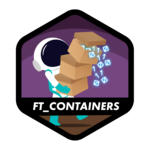
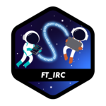

# 👋 Hi there 🇧🇷
I'm Andrey & welcome to my github page 🙂. 
I'm a <a href="https://profile.intra.42.fr/users/adantas-" target="_blank">cadet at 42sp 👨‍🚀🚀👽</a> studying to become a <bold>human coder</bold>. 
Besides learning programming languages i'm also learning human languages, more specifically english🇺🇸, japanese🇯🇵, spanish🇪🇸, german🇩🇪, italian🇮🇹, french🇫🇷 and esperanto🇪🇺. 

### 🏕️ Basecamp Achievements 🏅
 

### 🏊‍♂️ Piscine Achievements 🏅
 

### 🤖 42 Achievements and Badges 🏅

#### I made the 🇧🇷 version of [MiniLibX Documentation](https://github.com/andreyvdl/MiniLibX_my_docs) 

<table>
	<tr>
		<th></th>
		<th></th>
		<th></th>
	</tr>
	<tr>
		<td></td>
		<td></td>
		<td></td>
	</tr>
	<tr>
		<td></td>
		<td>"></td>
		<td>bar"></td>
	</tr>
	<tr>
		<td></td>
		<td></td>
		<td></td>
	</tr>
	<tr>
		<td></td>
		<td></td>
		<td></td>
	</tr>
	<tr>
		<td></td>
		<td></td>
		<td></td>
	</tr>
	<tr>
		<td></td>
	</tr>
</table>

## 🔰 Skills: 
 BASH |  Clang |  CSS3 |  HTML5 |  Javascript |  Photoshop |  VIM |  GOlang |  VSCode |  Linux/Debian
:---: | :---: | :---: | :---: | :---: | :---: | :---: | :---: | :---: | :---:

## 🧠 Others:

  

<a href="https://github.com/andreyvdl">

 

<!--
**andreyvdl/andreyvdl** is a ✨ _special_ ✨ repository because its `README.md` (this file) appears on your GitHub profile.

Here are some ideas to get you started:

- 🔭 I’m currently working on ...
- 🌱 I’m currently learning Clang and Golang
- 👯 I’m looking to collaborate on ...
- 🤔 I’m looking for help with ...
- 💬 Ask me about ...
- 📫 How to reach me: ...
- 😄 Pronouns: male pronouns
- ⚡ Fun fact: ...
-->

