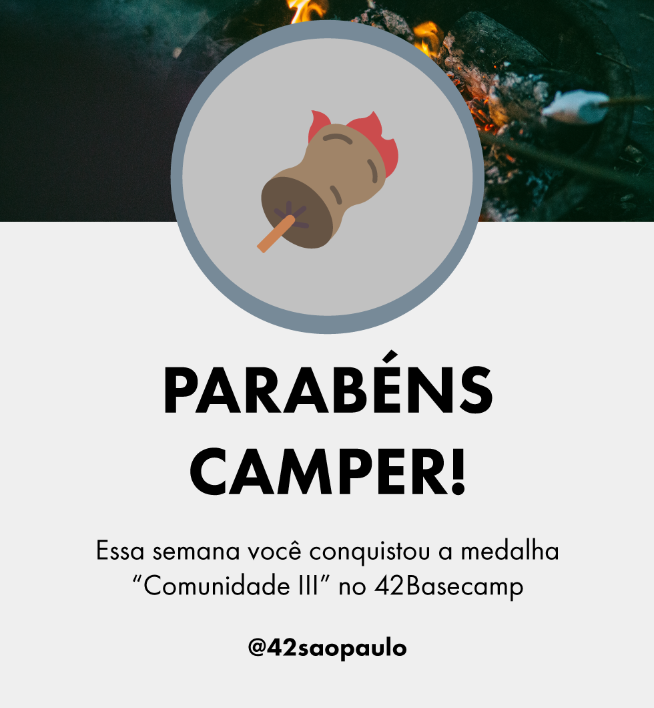

# 👋 Hi there 

I'm Andrey & welcome to my github page 🙂. 
I'm a cadet at 42sp 👨‍🚀🚀👽 studying to become a <bold>human coder</bold> and then a game dev/mobile dev. 

    

## 🧠 Soft Skills: 
 BASH |  C language |  CSS3 |  HTML5 |  Javascript |  Photoshop |  VIM
:---: | :---: | :---: | :---: | :---: | :---: | :---:
 

<a href="https://github.com/andreyvdl">

 

<!--
**andreyvdl/andreyvdl** is a ✨ _special_ ✨ repository because its `README.md` (this file) appears on your GitHub profile.

Here are some ideas to get you started:

- 🔭 I’m currently working on ...
- 🌱 I’m currently learning ...
- 👯 I’m looking to collaborate on ...
- 🤔 I’m looking for help with ...
- 💬 Ask me about ...
- 📫 How to reach me: ...
- 😄 Pronouns: ...
- ⚡ Fun fact: ...
-->

