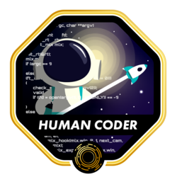

<h1>👋 Hi there 🇧🇷</h1>

I'm Andrey & welcome to my github page 🙂.
<br>
I'm a [Alumnus at 42sp 👨‍🚀🚀👽](https://profile.intra.42.fr/users/adantas-) and a junior software engineer.
<br>

```c
int main(void)
{
    srand(time(0x0));
    while (me.alive)
    {
        make_something(&me, rand());
        snooze(&me);
    }
    return (EXIT_SUCCESS);
}
```

Want to talk with me?  
<-- here are my socials

[comment]: <> (My evolution on the 42 CV)

### 42 Badges 🏅

#### I made the 🇧🇷 version of [MiniLibX Documentation](https://github.com/andreyvdl/MiniLibX_my_docs)

&#xA0;&#xA0;&#xA0;&#xA0;&#xA0;&#xA0;&#xA0;&#xA0;&#xA0;&#xA0;&#xA0;&#xA0;&#xA0;&#xA0;&#xA0;&#xA0;&#xA0;&#xA0;&#xA0;&#xA0;&#xA0;&#xA0;&#xA0;&#xA0;&#xA0;&#xA0;&#xA0;[](https://github.com/andreyvdl)   
[](https://github.com/andreyvdl/42SP-Phase1)
[](https://github.com/andreyvdl/42SP-Phase2)
[](https://github.com/andreyvdl/42SP-Phase3)

[comment]: <> (Things i know how to work)
[comment]: <> (The color tells how much I know 🔴 low-mid, 🟡 mid, 🟢 mid-top)
[comment]: <> (The star tells if is something I like to use)

## 🔰 Tech stacks:

- C | C++
- BASH
- GO
- Java
- C# | .NET | ASP.NET | .NET MVC
- SQL
- Typescript | Javascript
- Bootstrap
- Three.js
- Docker | Compose
- Python
- Django
- API REST

[](https://github.com/andreyvdl)
[](https://github.com/andreyvdl)
[](https://roadmap.sh)
